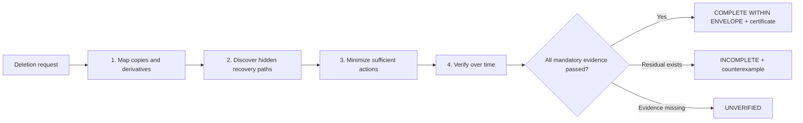
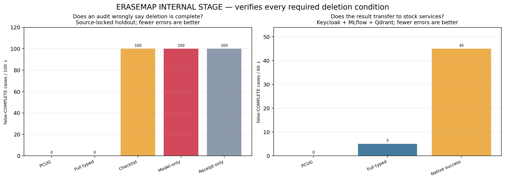
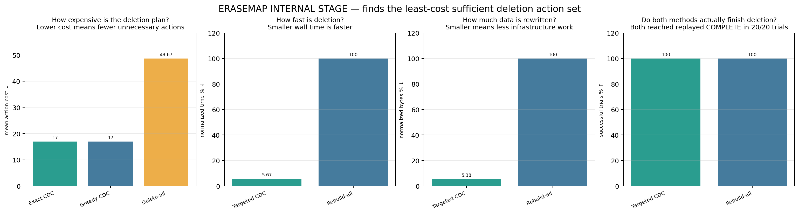
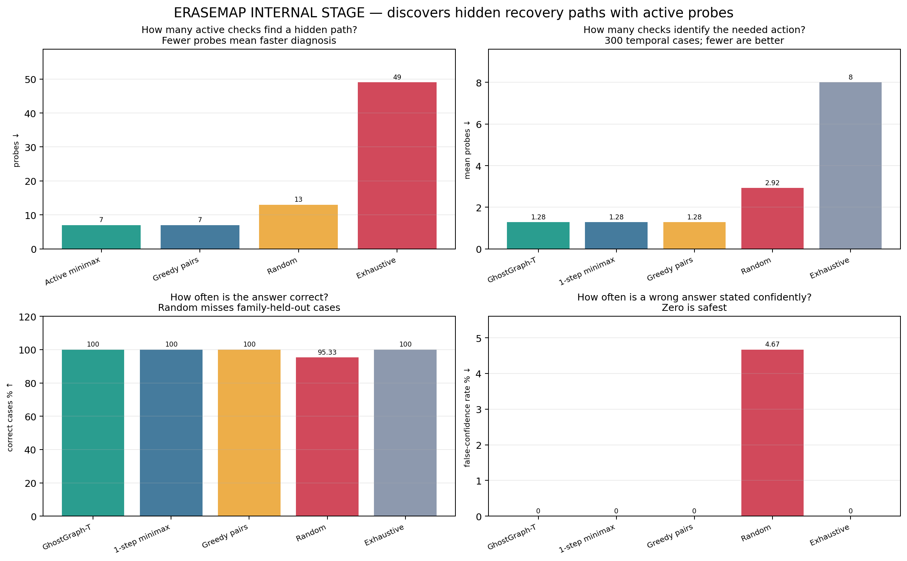
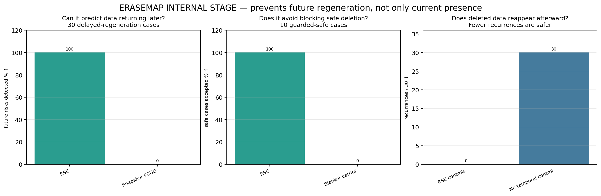
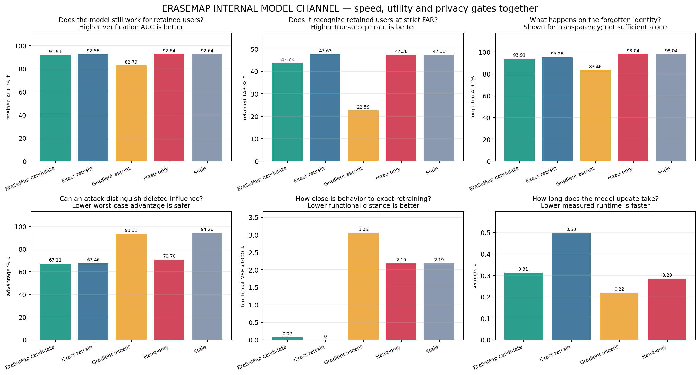
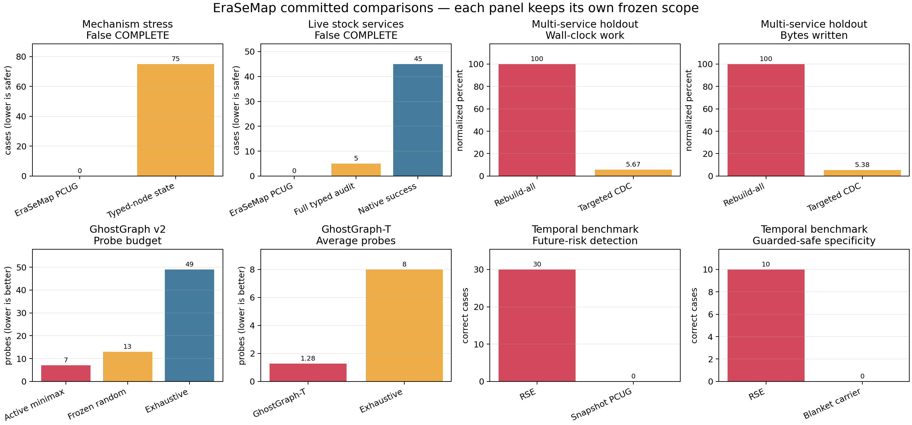

# EraSeMap

EraSeMap answers one concrete question: **after a biometric deletion request, which registered
copy or derivative can still be used?** It models the source record, Face ID template, search
index, cache, backup, model influence, and audit receipt as a typed lineage graph. The auditor
returns `COMPLETE`, `INCOMPLETE`, or `UNVERIFIED`, plus the shortest counterexample path and a
cost-aware remediation plan.

The project is intentionally system-neutral: the same graph contract can describe a school
access system, a bank KYC flow, or a government identity service. That portability is a research
hypothesis to test, not a claim of production validation.

EraSeMap covers only artifacts registered by trusted instrumentation. It does not prove global
physical erasure, detect secret unregistered copies, provide legal advice, or claim validation on
eGov, Face ID, or another production identity system.

For a user or judge, EraSeMap is **one algorithm with five stages**:

1. map registered copies and derivatives;
2. actively discover bounded hidden recovery paths;
3. choose the least-cost sufficient deletion actions;
4. replay delayed recovery scenarios;
5. issue a certificate only if every mandatory check passes.

The research names PCUG, GhostGraph, CDC, RSE, MSC, TRE, and Erasure Tomography are retained only
inside the scientific and reproducibility sections. They are representations, solvers, or bounded
experiments supporting these five stages—not separate products or separate algorithms to present.

## Quick demonstration

```bash
erasemap audit examples/five_branch_system.json --subject subject-1
erasemap generate --seed 7 --nodes 100 --fault STALE_CACHE --output /tmp/case.json
erasemap benchmark dev --protocol benchmark/protocol-v1.json --output outputs/dev-v1
erasemap showcase --repo-root . --output outputs/jury-showcase-v1
erasemap bank-demo --output outputs/synthetic-bank-demo-v1
erasemap bank-control-plane generate --output outputs/synthetic-bank-control-plane-v1
erasemap bank-control-plane serve --port 8765
erasemap rse demo --seed 101
PYTHONPATH=src:. python scripts/verify_erasure_tomography_v1.py
PYTHONPATH=src:. python scripts/verify_erasure_tomography_redis_v1.py
PYTHONPATH=src:. python scripts/verify_ghostgraph_v2.py
PYTHONPATH=src:. python scripts/verify_ghostgraph_live_v2.py
PYTHONPATH=src:. python scripts/verify_ghostgraph_t_v1.py
PYTHONPATH=src:. python -m external_ghostgraph_challenge.verify_v2 --help
```

The fixed example contains an erased enrollment record with one still-active face template, so
the first command returns `INCOMPLETE` and the path `source -> template`. An incomplete audit is a
valid scientific result and therefore exits successfully.

See [docs/CORE_PROTOCOL.md](docs/CORE_PROTOCOL.md) for the frozen experiment, baselines, evidence
contracts, receipt boundary, and interpretation rules.

For a judge-facing demonstration, open `outputs/jury-showcase-v1/index.html` after the final
command. It recomputes the live counterexample, validates the frozen headline results, embeds source
hashes, and keeps the external-independence limitation visible. The evidence-anchored scorecard,
Russian defense script, and adversarial Q&A are in
[`docs/COMPETITION_EVIDENCE_SCORECARD.md`](docs/COMPETITION_EVIDENCE_SCORECARD.md),
[`docs/JURY_DEFENSE_RU.md`](docs/JURY_DEFENSE_RU.md), and
[`docs/JUDGE_QA_RU.md`](docs/JUDGE_QA_RU.md). The editable 13-slide PowerPoint is
[`competition/EraSeMap_RKNP_ISEF_RU.pptx`](competition/EraSeMap_RKNP_ISEF_RU.pptx).

For a live visual story, `bank-demo` writes a self-contained clickable **synthetic bank KYC
sandbox**. It shows a deletion request, a delayed backup-restore recurrence, bounded hidden-path
probes, exact remediation, and a replay-verified synthetic certificate. It has no network calls and
is explicitly not a bank, eGov, Face ID, or production-system integration.

For a stateful product demonstration, `bank-control-plane serve` starts a loopback-only local API
and dashboard with **512 generated customers**, **3,072 registered artifacts**, searchable customer
records, five synthetic connector contracts (PostgreSQL, Keycloak, Redis, Qdrant, and MinIO),
approval-required dry runs, ordered deletion actions, delayed recurrence, bounded hidden-path
localization, replay verification, and protection of the other 511 customers. The adapters execute
only against the in-memory synthetic sandbox. They are connector contracts and product UX evidence,
not a connection to an organization or validation of production deletion. The Russian launch guide,
data-channel table, jury walkthrough, and claim boundary are in
[`docs/SYNTHETIC_BANK_CONTROL_PLANE_RU.md`](docs/SYNTHETIC_BANK_CONTROL_PLANE_RU.md).

## Proof-Carrying Unlearning Graph

The prospective PCUG core extends the v1 node audit with a **Counterfactual Deletion Cut**. It
replays candidate actions, treats every subject-derived physical artifact as a deletion terminal,
keeps shared models physically active, and closes only the request-scoped influence edge when all
mandatory model channels pass. Exact CDC is checked against a brute-force oracle; greedy CDC remains
a named approximation baseline.

A signed proof bundle includes the committed graph, protocol, selected actions, hidden-challenge
opening, raw channel results, and declared verdict. The independent checker verifies the signature
and commitments, replays every transition, recomputes paths and channel decisions, and rejects a
signed but false `COMPLETE` field.

```bash
erasemap pcug demo \
  --adapter egov_style --seed 4409 \
  --output /tmp/pcug-demo.json \
  --public-key-output /tmp/pcug-public-key.pem
erasemap pcug verify /tmp/pcug-demo.json \
  --public-key /tmp/pcug-public-key.pem
erasemap pcug benchmark development \
  --protocol benchmark/pcug-protocol-v1.json \
  --output outputs/pcug-development-v1
```

`faceid_style`, `egov_style`, `kyc_style`, and `school_style` are display adapters over the same
synthetic graph semantics. They are not integrations with Apple, eGov, a bank, or a school. See
[docs/PCUG_PROTOCOL.md](docs/PCUG_PROTOCOL.md) for the formal decision and claim boundary.

| Component | Current evidence status |
|---|---|
| Typed residual-path audit v1 | Measured controlled benchmark; see `docs/CORE_PROTOCOL.md` |
| Deletion-matched model experiments | Original MUFAC v3 retained-utility gate failed; adaptive v3.2 passed the unchanged bounded gates on the exposed subset; exact retraining remains the fallback |
| PCUG/CDC and RSE/MSC deterministic cores | Lean-checked conditional soundness and finite optimality; bounded Python conformance PASS |
| PCUG controlled development benchmark | Registered synthetic simulator; results must be read from its exported manifest |
| PCUG source-structure generalization | v1 PASS on 125 source-derived cases; project-authored mappings/execution |
| Real service-process pilot | PostgreSQL 15.18 isolated cluster PASS; synthetic records, not an organization |
| Measured multi-service optimization | 20-pair real-process holdout PASS; local synthetic records |
| Open stock-service transfer v1 | First frozen 60-case run PASS on Keycloak, MLflow, and Qdrant; public Olivetti vectors plus synthetic identities/commitments; project-authored faults |
| Independent hidden challenge | Executable freeze/commit/score kit ready; no external run claimed |
| Sequential deletion privacy v1 | Preregistered first run PASS: 25 transitions, all six frozen gates; project-authored |
| Regeneration-Safe Erasure v2 | Preregistered first run PASS: 30/30 risks, 10/10 guarded safe cases, 10/10 coverage faults; project-authored |
| Topology-Robust Erasure v1 | Preregistered first run PASS: nominal MSC failed under 35/35 shifts, TRE had 0/35 recurrences; finite project-authored envelope |
| Erasure Tomography v1 | Preregistered bounded first run PASS: 8/8 exact localization, 4/4 negative cases fail-closed, 3 probes versus 4 individual checks; project-authored |
| Live Redis tomography transfer | Preregistered digest-pinned stock-service PASS: 4/4 exact localization, safe-case PASS, zero false localization/recurrence/retained loss; project-authored workflows |
| GhostGraph v2 | Frozen strategy comparison PASS: 3 exact graphs, 2 path classes, OUT/UNVERIFIED negatives, 7 active vs 13 random vs 49 exhaustive probes, zero false confidence/oracle mismatch/recurrence/retained loss |
| GhostGraph live four-service v2 | First digest-pinned Docker run PASS: 5 cases, 5 probes, 3 exact/path recoveries, OUT and safe detected, zero false confidence/recurrence/retained loss/cleanup failure |
| GhostGraph-T v1 | Separately frozen 300-case action-identification run PASS: 300/300 correct, 50/50 family-OOD, 0 false confidence, 1.28 vs 8.0 exhaustive probes; strong adaptive baselines tied |
| Time-bound erasure certificate | Independent replay context, topology/envelope/model commitments, expiry and drift invalidation implemented and tested; not a production attestation |
| External GhostGraph challenge v2 | Interactive blind adapter, sealed truth, source-bound manifest, computed nine gates, and non-project Ed25519 verification ready; genuine evaluator result `NOT_COLLECTED` |
| External temporal hidden challenge | Commit/blind-run/reveal/score kit ready; no external run claimed |
| Organization production pilot | Machine-validated protocol ready; no organization run claimed |
| Production FaceID/eGov applicability | Not established; requires authorized instrumentation and evaluation |

## One algorithm: EraSeMap

The project now has **one public algorithm**, not five algorithms to memorize:

> **EraSeMap maps every copy and derivative, actively finds hidden recovery paths, selects the
> least-cost sufficient deletion actions, verifies that the data cannot return, and only then
> permits a replayable certificate.**



PCUG, GhostGraph, CDC, RSE, MSC, and TRE remain internal implementation and paper names for
reproducibility. For a presentation they are simply stages of EraSeMap. Model unlearning is one
possible deletion action inside stage 3; if its utility/privacy gates fail, exact retraining is the
safety fallback.

The executable entry point [`run_erasemap`](src/erasemap/unified.py) enforces this composition. It
cannot return `COMPLETE_WITHIN_ENVELOPE` unless the registered deletion plan, active topology
evidence, and temporal replay all pass. The full input/output definition and short decision rule are
in [`docs/ERASEMAP_UNIFIED_ALGORITHM.md`](docs/ERASEMAP_UNIFIED_ALGORITHM.md).

### Direct comparison with non-EraSeMap algorithms and baselines

Each graph states exactly what it measures and which direction is better. The green bar is the
relevant result from the unified EraSeMap pipeline. The other bars are non-EraSeMap algorithms or
operational baselines run by this project under the same frozen protocol for that panel.


The result is strong but not artificially perfect:

| Outcome | Direct evidence |
|---|---|
| **Safer** | 0 false-COMPLETE cases versus 5 for a full typed audit and 45 for native service-success signals on 60 stock-service cases. |
| **Fewer probes** | 7 active probes versus 13 random and 49 exhaustive probes on the same hidden-path catalogue. |
| **Tie** | Mean action cost 17 for EraSeMap and greedy set cover on the small development set; delete-everything cost 48.67. |
| **Less work** | The same 20/20 replayed-COMPLETE outcome at 5.67% of rebuild-all wall time and 5.38% of its bytes written. |
| **Temporal advantage** | 30/30 registered delayed-regeneration risks detected versus 0/30 for a present-time snapshot audit. |

These are not cross-paper leaderboard values or independent external reproductions. Each panel is a
separate same-protocol experiment, and values are never pooled into one score. Detailed component
plots are kept only as a reproducibility appendix below. The hidden-path and temporal panels remain
a project-authored bounded result, not an independent or production validation.

<details>
<summary>Scientific component-level comparison appendix</summary>













</details>

The chart inputs and provenance paths are frozen in
[`benchmark/evidence-charts-v1.json`](benchmark/evidence-charts-v1.json). Rebuild every figure with:

```bash
.venv/bin/pip install -e '.[face]'
.venv/bin/python experiments/render_evidence_comparisons.py
```

## Erasure Tomography

The frozen v1 candidate catalogue contains backup restore, checkpoint redeployment, legacy export
import, and retry queue replay. An exact constructor found a three-row Boolean probe design for the
empty support and every single active mechanism (`k=1`, `e=0`). The prospective local result
recovered 8/8 valid supports, returned `UNVERIFIED` for 4/4 deliberately broken-assumption cases,
matched an independent bitmask oracle, and produced no recurrence after TRE control replay.

A second preregistered run executed the same bounded signatures inside a real digest-pinned Redis
container: 4/4 mechanisms and the safe case passed with zero false localization, oracle mismatch,
post-control recurrence, or retained-subject loss. The container workflows and execution were
project-authored, so this strengthens transfer and engineering evidence but not external
independence.

See [`docs/ERASURE_TOMOGRAPHY_V1_REPORT.md`](docs/ERASURE_TOMOGRAPHY_V1_REPORT.md), the frozen
protocols under [`benchmark/`](benchmark/), committed results under `outputs/erasure-tomography-*`,
and the Lean boundary in `EraseMapFormal/ErasureTomography.lean`.

## GhostGraph v2

GhostGraph asks a different question from PCUG: if several registered recurrence topologies are
still plausible, which safe synthetic intervention should be run next? Its exact planner partitions
the current version space by predicted temporal trace and minimizes the largest surviving bucket,
then squared bucket sizes, declared cost, and experiment ID. An independently implemented bitmask
oracle recomputes every choice. The result is an exact graph, a complete erasure-relevant path
class, `OUT_OF_HYPOTHESIS`, or `UNVERIFIED`—never confidence from missing evidence.

The frozen v2 strategy comparison passed all gates with **7** active probes, compared with **13**
for frozen random and **49** for exhaustive testing. A greedy separated-pairs baseline tied at 7 in
this small catalogue, so global decision-tree optimality is not claimed. Passive declared lineage
and flat tomography each produced one false-confident output. The live v2 run then reproduced the
safety endpoints through native APIs of four stock services with no managed containers left after
cleanup.

The external v2 kit in [`external_ghostgraph_challenge/`](external_ghostgraph_challenge/) removes
pre-disclosed traces: an outside evaluator authors and seals hidden graphs, and the frozen project
runner adaptively requests one trace at a time. After reveal, the verifier recomputes the complete
execution and checks source hashes, commitments, a clean commit declaration, and a non-project
Ed25519 signature. This makes an external run executable; it does not make one exist. Current status
remains `NOT_COLLECTED`, and evidence independence remains **7.8/10**.

## GhostGraph-T v1

GhostGraph-T groups hidden graphs by their complete set of minimum operation cuts. The exact global
policy stops when all survivors require the same action, even if irrelevant topology remains
indistinguishable. Lean proves the conditional soundness of that stopping rule and constructs the
finite impossibility boundary for two query-indistinguishable graphs requiring different actions.

The protocol was committed before its first result. The locked run covered 120 unseen instances,
80 unseen two-family compositions, 50 fully held-out retry-replay cases, and 50 declared temporal
shifts. A held-out family can only receive `OUT_OF_HYPOTHESIS`; it is not falsely localized. The
global policy matched the recursive oracle on all three catalogue problems. It tied one-step
minimax and greedy, beat frozen random and exhaustive, and exposed why exact graph identity is too
strong for action-safe stopping.

See [`docs/GHOSTGRAPH_T_V1_REPORT.md`](docs/GHOSTGRAPH_T_V1_REPORT.md), the frozen protocol at
[`benchmark/ghostgraph-t-v1.json`](benchmark/ghostgraph-t-v1.json), and the committed result under
[`outputs/ghostgraph-t-v1/`](outputs/ghostgraph-t-v1/).

## Open stock-service transfer challenge

The first frozen v1 run executed 60 cases across digest-pinned stock Keycloak 26.7.1, MLflow
3.15.1-full, and Qdrant 1.15.4 processes. Qdrant used five preregistered confirmatory subjects from
the public Olivetti faces source as untrained 4,096-dimensional vectors; identity names and MLflow
commitments were deterministic synthetic inputs. EraSeMap produced **0 false-complete decisions**,
failed closed on all **15/15 coverage faults**, matched a separate exhaustive control oracle
in **60/60 cases**, and recorded **0 retained-subject losses** and **0 post-control recurrences**.
Native-success produced 45 false-complete decisions and the full typed-node audit produced 5.

The protocol, first-run trials, redacted HTTP evidence, public-input provenance, immutable image
digests, and offline verifier are committed under [`outputs/open-transfer-v1/`](outputs/open-transfer-v1/).
Recompute the result with:

```bash
PYTHONPATH=src:. .venv/bin/python scripts/verify_open_transfer_v1.py \
  --result outputs/open-transfer-v1/result.json
```

This strengthens real-process transfer evidence but does not change the 7.8/10 independence status:
service selection, adapters, mappings, fault states, and execution were project-authored. The
answer-blind EN/RU usability packet in [`usability/`](usability/README.md) has no participant result,
and [`external_transfer/`](external_transfer/README.md) contains a signed handoff rather than a
fabricated external submission.

## Source-locked multi-system holdout

The first committed external-structure holdout derives five distinct case families from official
NIST SP 800-63A, W3C PROV-O, OpenSearch, MLflow, and PostgreSQL documentation. It contains 125 unique
cases rather than relabelled FaceID/eGov/KYC/School adapters. In the one-shot run PCUG recorded
0/100 false-complete decisions on non-complete cases (Wilson 95% upper bound 0.0370), 25/25 complete
specificity, and zero exceptions.

The strongest typed-node baseline tied PCUG at 0/100. This is therefore evidence of transfer to the
frozen source-derived structures, not evidence that PCUG outperforms every complete typed audit.
Mappings and execution remain project-authored, and no production organization was accessed. See
[`docs/SOURCE_LOCKED_HOLDOUT_V1_REPORT.md`](docs/SOURCE_LOCKED_HOLDOUT_V1_REPORT.md) and the raw,
hash-verified records under `outputs/source-locked-holdout-v1/`.

MUFAC's original approximate-model utility failure remains unchanged. The v2 safe policy now blocks
that candidate and falls back to exact retraining, preserving retained CKA 1.0 at 1.0x speed rather
than presenting a failed fast method as complete. See
[`docs/MUFAC_SAFE_POLICY_V2_REPORT.md`](docs/MUFAC_SAFE_POLICY_V2_REPORT.md).

The adaptive v3.2 follow-up increased deletion-matched restart from 80 to 120 epochs while exact
retraining remained 200 epochs. On the frozen MUFAC subset it passed the unchanged utility and
privacy gates with retained-AUC difference −0.00653 and 1.59× mean speedup. MUFAC had already been
exposed, so this is method-improvement evidence rather than a new independent confirmation. See
[`docs/TASK_AGNOSTIC_V32_REPORT.md`](docs/TASK_AGNOSTIC_V32_REPORT.md).

A separate mechanism stress test demonstrates the reason for PCUG beyond typed node coverage:
PCUG caught 75/75 failed or unknown mandatory channel/replay cases while a node-only typed audit
declared all 75 complete. A real isolated PostgreSQL pilot also detected a surviving derived row and
physical dump after source deletion. See
[`docs/PCUG_STRESS_AND_POSTGRES_PILOT.md`](docs/PCUG_STRESS_AND_POSTGRES_PILOT.md). These are
development and local-pilot results, not replacements for an independently authored hidden suite.

The external challenge kit now rejects incomplete prediction sets, freezes every prediction with a
SHA-256 commitment, reveals labels only after the freeze, and automatically applies preregistered
Wilson, accuracy, case-count, and independently authored family-count gates. The minimum is 120
cases across four external families, including 100 non-complete cases. See
[`external_challenge/README.md`](external_challenge/README.md). This is an executable route to
independent evidence; it is not itself an independent result.

The external evidence registry additionally binds evaluator identity metadata, external repository
commit, tested EraSeMap commit, four-family provenance, file hashes, freeze/reveal timestamps, score,
and Ed25519 signature. CI recomputes predictions and scoring and rejects algorithm drift after the
tested commit. Its independence status remains **7.8/10 and pending** until an externally
identifiable evaluator submits and signs a passing run. See
[`docs/INDEPENDENCE_EVIDENCE_RUBRIC.md`](docs/INDEPENDENCE_EVIDENCE_RUBRIC.md).

An external organization can use [`docs/PRODUCTION_PILOT_PROTOCOL.md`](docs/PRODUCTION_PILOT_PROTOCOL.md)
and the machine-validated [`pilot/manifest-template.json`](pilot/manifest-template.json) to freeze
the algorithm commit, register two or more real persistence systems, and publish only redacted
artifact hashes. Until an external evaluator completes and signs that record, production validation
remains explicitly unclaimed.

The preregistered measured multi-service v1 experiment used real PostgreSQL, Redis, and Qdrant
processes plus AES-GCM backups and an exactly updatable ridge model. Across 20 one-shot paired
holdout seeds, exact CDC preserved `COMPLETE` and all retained identities while achieving a `17.64x`
geometric-mean speedup (paired bootstrap 95% CI `[16.39x, 18.98x]`) and `94.62%` fewer declared
application/filesystem bytes than rebuild-all. See
[`docs/MEASURED_MULTISERVICE_V1_REPORT.md`](docs/MEASURED_MULTISERVICE_V1_REPORT.md). This remains a
local synthetic systems experiment, not external production evidence.

The formal PCUG v1 contribution is machine-checked in Lean 4. Under explicit complete-topology and
sound-verifier assumptions, replayed `COMPLETE` rules out represented real residual paths and
discharges all mandatory channels. A separate executable theorem proves feasibility and global
minimum cost for finite exhaustive CDC selection. Production `exact_cdc` matched its exhaustive
oracle in all 3,072 preregistered cost/permission/order conformance runs. See
[`formal/README.md`](formal/README.md) and
[`docs/FORMAL_PCUG_V1_REPORT.md`](docs/FORMAL_PCUG_V1_REPORT.md). This does not prove discovery of
unregistered infrastructure or correctness of an external deployment.

The formal RSE/MSC layer now composes temporal feasibility soundness with exact finite selection:
a selected MSC is temporally safe under the stated registered-transition assumptions and no more
expensive than another listed feasible control set. Production branch-and-bound also matched a
separately implemented exhaustive oracle over all 16 carrier subsets, 64 permission masks, eight
adversarial cost catalogues, and two input orders: **16,384/16,384** configurations. See
[`formal/README.md`](formal/README.md) and
[`docs/SCIENTIFIC_CLAIM_MATRIX.md`](docs/SCIENTIFIC_CLAIM_MATRIX.md). This is bounded conformance,
not independent evaluation or proof that an external topology is complete.

The TRE layer selects one control set across a finite declared topology uncertainty envelope.
Lean conditionally proves all-scenario safety and minimum cost; production branch-and-bound matched
a separate exhaustive oracle in **4,096/4,096** envelope/cost/permission/order configurations. This
does not prove that the declared envelope contains an arbitrary real topology.

The preregistered sequential-deletion privacy v1 experiment passed all six frozen gates on its
first run: 25/25 deleted classifier classes were absent, the worst retained-accuracy difference
from exact retraining was −0.00952, the worst forgotten-verification AUC gap was 0.00395, and the
largest paired upper 95% confidence bound for additional release-difference membership advantage
was 0.00624 against the 0.05 limit. The candidate used a 60/100 epoch budget (1.667×). This is a
project-authored Olivetti result using four no-shadow-model attacks, not independent validation or
a general privacy guarantee. See
[`docs/SEQUENTIAL_DELETION_PRIVACY_V1_REPORT.md`](docs/SEQUENTIAL_DELETION_PRIVACY_V1_REPORT.md).

The novelty claim has been narrowed after a structured literature and patent search; lineage-aware
deletion graphs and proof-of-deletion are prior art. See
[`docs/STRUCTURED_PRIOR_ART_AND_PATENT_REVIEW.md`](docs/STRUCTURED_PRIOR_ART_AND_PATENT_REVIEW.md).

## Regeneration-Safe Erasure

Snapshot deletion is not necessarily stable under future restore, ETL, index rebuild, or model
training operations. RSE computes the finite closure of a registered subject-specific transition
catalogue, returns a shortest reproducible regeneration witness, and refuses `RSE_VERIFIED` when a
declared sensor is missing, an observation is unverified, or a runtime transition is unregistered.
Its exact Minimal Stabilization Cut selects the least-cost set of subject-scoped guards that removes
every registered regeneration witness.

The first local development run used SQLite, a JSON cache, a NumPy vector index, an AES-GCM backup,
and a model manifest. An online-only snapshot missed 20/20 later backup restorations; RSE detected
20/20, selected a cost-7 persistent tombstone instead of cost-40 backup destruction, and physical
replay produced 0/20 post-control recurrences. This is project-authored mechanism evidence, not an
independent or production result. See
[`docs/REGENERATION_SAFE_ERASURE_V1_REPORT.md`](docs/REGENERATION_SAFE_ERASURE_V1_REPORT.md).

The publicly preregistered multi-path v2 experiment adds four physically distinct latent carriers:
encrypted backup, legacy export, retry queue, and old model checkpoint. Its first frozen run passed
all gates: RSE detected 30/30 registered risks, verified 10/10 guarded safe cases, failed closed on
10/10 transition-coverage faults, matched an independent exhaustive subset oracle, and produced
0/30 physical recurrences after the exact MSC. A strong snapshot PCUG audit correctly established
current absence but missed all 30 later replays; a blanket-carrier audit rejected all ten safe
guarded cases. This distinguishes a snapshot property from a registered temporal invariant rather
than claiming that ordinary PCUG ignores active backups. See
[`docs/REGENERATION_SAFE_ERASURE_V2_REPORT.md`](docs/REGENERATION_SAFE_ERASURE_V2_REPORT.md).

## Topology-Robust Erasure

Ordinary MSC is exact for one registered map. TRE asks for one minimum-cost permitted control set
that passes the same temporal replay in every topology inside a finite, preregistered uncertainty
envelope. It also reports the shortest topology-shift witness and the declared robustness premium
over nominal MSC.

The first frozen experiment used eight scenarios: a nominal backup topology and all subsets of
three additional paths—legacy import, retry replay, and checkpoint redeployment. Across 35 physical
shifted cases, nominal MSC cost 3 and regenerated data in 35/35; TRE selected the shared tombstone
at cost 7, regenerated data in 0/35, and remained 53 declared cost units cheaper than blanket
carrier destruction. All frozen gates passed, but the envelope and execution are project-authored.
See [`docs/TOPOLOGY_ROBUST_ERASURE_V1_REPORT.md`](docs/TOPOLOGY_ROBUST_ERASURE_V1_REPORT.md).

```bash
PYTHONPATH=src python experiments/run_topology_robust_erasure_v1.py \
  --output /tmp/erasemap-tre-v1
python scripts/verify_topology_robust_erasure_v1.py \
  --result /tmp/erasemap-tre-v1/result.json
```

An external author can now create a sealed temporal suite, publish answer commitments, run the
frozen evaluator without labels, reveal the committed answers, and obtain an automatic gated score.
The kit is ready under [`external_temporal_challenge/`](external_temporal_challenge/README.md), but
it is not independent evidence until an identifiable external author actually completes it.

## Real-face unlearning benchmark

The repository contains reproducible biometric-deletion experiments on Olivetti Faces and a
locked LFW holdout. A face-specific MobileFaceNet embedding network feeds a locally trained neural
identifier. Four post-deletion strategies are compared: leaving the model stale, retraining only
its output head, approximate gradient-ascent unlearning, and exact retraining without the requested
identity. The benchmark separately measures visible deletion, retained-user utility, membership
leakage, and distance from the exact-retraining reference.


```bash
.venv/bin/pip install -e '.[dev,face]'
PYTHONPATH=src python experiments/prepare_face_assets.py
python -m erasemap.real_experiment
TORCH_HOME=data/real/torch PYTHONPATH=src \
  python experiments/run_resnet18_face_unlearning.py
PYTHONPATH=src python experiments/advanced_face_unlearning.py \
  --dataset olivetti --protocol benchmark/advanced-face-unlearning-v1.json \
  --output outputs/advanced-face-unlearning-v1
PYTHONPATH=src python experiments/advanced_face_unlearning.py \
  --dataset lfw --protocol benchmark/lfw-holdout-v1.json \
  --output outputs/lfw-holdout-v1
PYTHONPATH=src python experiments/run_registered_storage_lab.py
PYTHONPATH=src python experiments/run_regeneration_safe_erasure_v2.py
python scripts/verify_regeneration_safe_erasure_v2.py
```

## Qwen–TOFU Kaggle experiment

A frozen GPU protocol extends the model channel to the real open
[`Qwen/Qwen2.5-1.5B`](https://huggingface.co/Qwen/Qwen2.5-1.5B) base model and the external TOFU
benchmark. It compares a full-data QLoRA target, exact adapter retraining on `retain99`, and a paired
gradient-difference candidate across three seeds. The exact reference applies to the registered
adapter procedure only; no removal from Qwen pretraining is claimed.

The first valid three-seed Kaggle GPU result is a frozen **FAIL**, not a successful unlearning
claim. Six gates validly passed, two failed, and the apparent perturbed-answer pass was later found
unevaluable because v1 read the ordinary `answer` field instead of TOFU's `paraphrased_answer` and
`perturbed_answer` fields. One seed missed the candidate forgetting minimum
(`0.04837 < 0.05`) and world-fact degradation reached `0.45300` against the `0.20` maximum. Exact
adapter retraining passed its forgetting gate and save/reload recurrence was zero. EraSeMap
therefore correctly keeps the model channel incomplete. The result and earlier infrastructure
attempts are recorded in
[`docs/QWEN_TOFU_KAGGLE_V1_RUN_LOG.md`](docs/QWEN_TOFU_KAGGLE_V1_RUN_LOG.md):

```bash
scripts/kaggle_qwen_tofu_v1.sh submit
scripts/kaggle_qwen_tofu_v1.sh status
scripts/kaggle_qwen_tofu_v1.sh collect
```

See [`docs/QWEN_TOFU_KAGGLE_V1_PREREGISTRATION.md`](docs/QWEN_TOFU_KAGGLE_V1_PREREGISTRATION.md)
and [`docs/QWEN_TOFU_KAGGLE_V1_REPORT.md`](docs/QWEN_TOFU_KAGGLE_V1_REPORT.md).

The frozen adaptive v2 follow-up corrected the semantic evaluator, replaced the loose absolute
forget-gap rule with normalized recovery against exact retraining, added disjoint real-author
anchors, and selected a utility-constrained selective-gradient candidate using only author-disjoint
development deletions. The first valid five-seed confirmation is also a retained **FAIL**. The
chosen candidate passed development, then overscrubbed every confirmation seed: normalized recovery
was 4.957–8.632 against the frozen 0.8–1.25 interval. It passed 8/12 conjunctive gates, including
30.48x minimum speedup and zero reload recurrence, but failed exact-matched recovery, paraphrase,
retain, and membership endpoints. See
[`docs/QWEN_TOFU_KAGGLE_V2_PREREGISTRATION.md`](docs/QWEN_TOFU_KAGGLE_V2_PREREGISTRATION.md) and
[`docs/QWEN_TOFU_KAGGLE_V2_REPORT.md`](docs/QWEN_TOFU_KAGGLE_V2_REPORT.md).

```bash
scripts/kaggle_qwen_tofu_v2.sh submit
scripts/kaggle_qwen_tofu_v2.sh status
scripts/kaggle_qwen_tofu_v2.sh collect
```

The prospective v3 study is frozen before its first GPU execution. Its Reference-Bounded Erasure
Path (RBEP) aligns deleted-author answers toward the pinned base model, preserves retained answers
toward the target adapter, caps the complete LoRA delta, and searches a declared checkpoint/alpha
path. Selection sees only five disclosed two-author folds and requires at least three contiguous
alphas that pass all 12 unchanged v2 gates. A self-hashed selection is written before either sealed
confirmation block can be loaded. The same choice is then tested on two untouched two-author blocks
and five new seeds each; all ten trials must pass. If no robust interval exists, the result is
fail-closed `NO_CANDIDATE` and confirmation is never opened.

There is currently **no v3 performance result**. The protocol-only verifier checks the frozen
model/data revisions, real SHA-256 author commitments, disjoint development/confirmation/reserve
split, unchanged gates, seeds, and selector. The first completed result will be retained whether it
is `PASS`, `FAIL`, or `NO_CANDIDATE`; any scientific change after this freeze requires v4.

```bash
PYTHONPATH=src:. python scripts/verify_qwen_tofu_kaggle_v3.py --protocol-only
scripts/kaggle_qwen_tofu_v3.sh submit
scripts/kaggle_qwen_tofu_v3.sh status
scripts/kaggle_qwen_tofu_v3.sh collect
```

See
[`docs/QWEN_TOFU_KAGGLE_V3_PREREGISTRATION.md`](docs/QWEN_TOFU_KAGGLE_V3_PREREGISTRATION.md) and
the approved
[`v3 design`](docs/superpowers/specs/2026-08-26-qwen-tofu-v3-reference-bounded-erasure-design.md).

See [docs/ADVANCED_UNLEARNING_REPORT.md](docs/ADVANCED_UNLEARNING_REPORT.md) for the locked results,
and [docs/REAL_FACE_EXPERIMENT.md](docs/REAL_FACE_EXPERIMENT.md) for the earlier baseline and strict
claim boundaries.

## Task-agnostic v2.2

Version 2.2 keeps the unchanged face-verification task, corrects the v2 primary-endpoint gate,
renames the neural update honestly to influence-selective unlearning, and evaluates six attacks:
four logit statistics, a 16-shadow-model task-agnostic LiRA variant, and an embedding nearest-
neighbour attack. The lineage graph selects whether model remediation is exact retraining, a
protocol-approved approximate update, or blocked pending evidence.

The method passed 100 deletion trials on each of Olivetti development, locked LFW confirmation,
and a content-unseen MUFAC subset frozen before its 572 images were accessed. The stronger v2.2
privacy audit was frozen later and passed on all three datasets without changing the unlearning
method. On MUFAC its LiRA AUC was 0.69519 versus 0.68865 for exact retraining, with 3.51× update
speedup. This is external benchmark evidence, not production validation or a privacy guarantee.

See [docs/TASK_AGNOSTIC_V22_REPORT.md](docs/TASK_AGNOSTIC_V22_REPORT.md) for the shadow-model threat
model, confidence intervals, critique response, and limitations. Earlier v2/v2.1 records remain
available. A real service can map its components through
[docs/INTEGRATION_CONTRACT.md](docs/INTEGRATION_CONTRACT.md).

## Registered v3 deletion-matched evaluation

Version 3 replaces the weak global-MSE/non-inferiority claim with separate forgotten and retained
endpoints. Its primary candidate is a fresh 60-epoch restart on retained identities only, compared
with a 200-epoch exact retrain using the same initialization. Privacy is gated per deletion request
and per attack using paired bootstrap confidence intervals, including an identity-level shadow
attack whose in-model shadows contain the whole identity and whose out-model shadows omit it.

The frozen development protocol passed 100 deletion requests: forgotten embedding MSE was 0.134×
the stale baseline, retained MSE was 0.152×, and the largest paired attack 95% upper bound was
0.076. Locked LFW also passed. MUFAC passed all deletion/privacy gates but failed the retained-AUC
gate (`−0.01324` versus the preregistered `−0.01` limit); that negative result is retained. The
adaptive 80-epoch v3.1 ablation did not fix the cross-dataset gate and exposed a privacy trade-off.
See [docs/TASK_AGNOSTIC_V3_REPORT.md](docs/TASK_AGNOSTIC_V3_REPORT.md) for all results and boundaries.

The separate pixel-backbone benchmark trains every convolutional and classifier parameter directly
from Olivetti images. It addresses the frozen-backbone limitation while explicitly remaining a
small-dataset research result, not a production FaceID claim. See
[docs/NOVELTY_AND_PRIOR_ART.md](docs/NOVELTY_AND_PRIOR_ART.md) for the narrow novelty boundary and
[docs/EXTERNAL_EVALUATOR_PROTOCOL.md](docs/EXTERNAL_EVALUATOR_PROTOCOL.md) for a precommitted hidden
suite interface.

Production evidence can be supplied as Ed25519-signed envelopes with trusted key identifiers,
freshness checks, and replay protection. A caller-supplied `valid_signature: true` boolean is a
legacy fixture mechanism, not a production trust boundary.

## Development

```bash
python3 -m venv .venv
.venv/bin/pip install --constraint constraints/local-py314.txt -e '.[dev,real]'
.venv/bin/python scripts/verify_ci_environment.py --constraints constraints/local-py314.txt
.venv/bin/pytest
.venv/bin/ruff check .
.venv/bin/mypy src/erasemap
```

One-command release checks are available as `scripts/reproduce_release.sh core`. The core profile
now mirrors the Python and Lean CI gates, verifies the committed open-transfer result and usability
kit, reruns both RSE experiments in temporary directories, verifies CDC, MSC, and TRE conformance
records, and fails if reproduction changes the worktree. The `transfer-live` profile additionally
runs and independently verifies a fresh 60-case stock-service experiment in a disposable directory;
the `face-open` profile rebuilds the open face assets and registered face experiments. EraSeMap code
is MIT licensed; third-party datasets and weights retain their own terms as documented in
[THIRD_PARTY_NOTICES.md](THIRD_PARTY_NOTICES.md).
