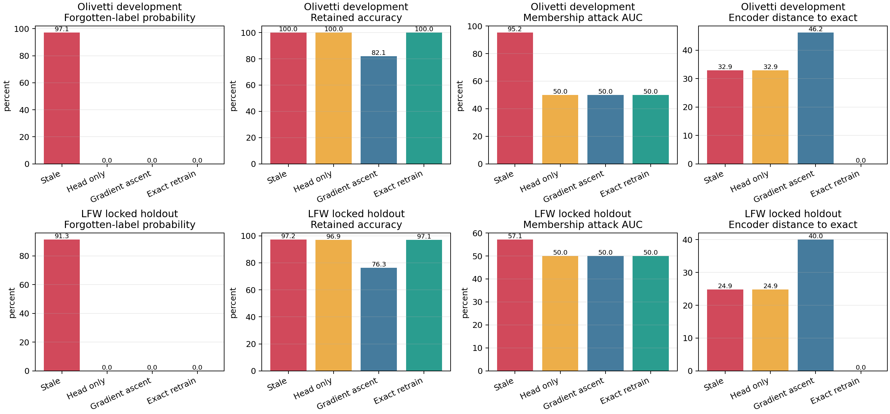

# EraseMap

EraseMap answers one concrete question: **after a biometric deletion request, which registered
copy or derivative can still be used?** It models the source record, Face ID template, search
index, cache, backup, model influence, and audit receipt as a typed lineage graph. The auditor
returns `COMPLETE`, `INCOMPLETE`, or `UNVERIFIED`, plus the shortest counterexample path and a
cost-aware remediation plan.

The project is intentionally system-neutral: the same graph contract can describe a school
access system, a bank KYC flow, or a government identity service. That portability is a research
hypothesis to test, not a claim of production validation.

EraseMap covers only artifacts registered by trusted instrumentation. It does not prove global
physical erasure, detect secret unregistered copies, provide legal advice, or claim validation on
eGov, Face ID, or another production identity system.

## Quick demonstration

```bash
erasemap audit examples/five_branch_system.json --subject subject-1
erasemap generate --seed 7 --nodes 100 --fault STALE_CACHE --output /tmp/case.json
erasemap benchmark dev --protocol benchmark/protocol-v1.json --output outputs/dev-v1
```

The fixed example contains an erased enrollment record with one still-active face template, so
the first command returns `INCOMPLETE` and the path `source -> template`. An incomplete audit is a
valid scientific result and therefore exits successfully.

See [docs/CORE_PROTOCOL.md](docs/CORE_PROTOCOL.md) for the frozen experiment, baselines, evidence
contracts, receipt boundary, and interpretation rules.

## Proof-Carrying Unlearning Graph

The prospective PCUG core extends the v1 node audit with a **Counterfactual Deletion Cut**. It
replays candidate actions, treats every subject-derived physical artifact as a deletion terminal,
keeps shared models physically active, and closes only the request-scoped influence edge when all
mandatory model channels pass. Exact CDC is checked against a brute-force oracle; greedy CDC remains
a named approximation baseline.

A signed proof bundle includes the committed graph, protocol, selected actions, hidden-challenge
opening, raw channel results, and declared verdict. The independent checker verifies the signature
and commitments, replays every transition, recomputes paths and channel decisions, and rejects a
signed but false `COMPLETE` field.

```bash
erasemap pcug demo \
  --adapter egov_style --seed 4409 \
  --output /tmp/pcug-demo.json \
  --public-key-output /tmp/pcug-public-key.pem
erasemap pcug verify /tmp/pcug-demo.json \
  --public-key /tmp/pcug-public-key.pem
erasemap pcug benchmark development \
  --protocol benchmark/pcug-protocol-v1.json \
  --output outputs/pcug-development-v1
```

`faceid_style`, `egov_style`, `kyc_style`, and `school_style` are display adapters over the same
synthetic graph semantics. They are not integrations with Apple, eGov, a bank, or a school. See
[docs/PCUG_PROTOCOL.md](docs/PCUG_PROTOCOL.md) for the formal decision and claim boundary.

| Component | Current evidence status |
|---|---|
| Typed residual-path audit v1 | Measured controlled benchmark; see `docs/CORE_PROTOCOL.md` |
| Deletion-matched model experiments v3 | Measured only on the named open datasets; MUFAC retained-utility gate failed |
| PCUG/CDC deterministic core | Lean-checked conditional soundness and finite optimality; bounded Python conformance PASS |
| PCUG controlled development benchmark | Registered synthetic simulator; results must be read from its exported manifest |
| PCUG source-structure generalization | v1 PASS on 125 source-derived cases; project-authored mappings/execution |
| Real service-process pilot | PostgreSQL 15.18 isolated cluster PASS; synthetic records, not an organization |
| Measured multi-service optimization | 20-pair real-process holdout PASS; local synthetic records |
| Independent hidden challenge | Executable freeze/commit/score kit ready; no external run claimed |
| Organization production pilot | Machine-validated protocol ready; no organization run claimed |
| Production FaceID/eGov applicability | Not established; requires authorized instrumentation and evaluation |

## Source-locked multi-system holdout

The first committed external-structure holdout derives five distinct case families from official
NIST SP 800-63A, W3C PROV-O, OpenSearch, MLflow, and PostgreSQL documentation. It contains 125 unique
cases rather than relabelled FaceID/eGov/KYC/School adapters. In the one-shot run PCUG recorded
0/100 false-complete decisions on non-complete cases (Wilson 95% upper bound 0.0370), 25/25 complete
specificity, and zero exceptions.

The strongest typed-node baseline tied PCUG at 0/100. This is therefore evidence of transfer to the
frozen source-derived structures, not evidence that PCUG outperforms every complete typed audit.
Mappings and execution remain project-authored, and no production organization was accessed. See
[`docs/SOURCE_LOCKED_HOLDOUT_V1_REPORT.md`](docs/SOURCE_LOCKED_HOLDOUT_V1_REPORT.md) and the raw,
hash-verified records under `outputs/source-locked-holdout-v1/`.

MUFAC's original approximate-model utility failure remains unchanged. The v2 safe policy now blocks
that candidate and falls back to exact retraining, preserving retained CKA 1.0 at 1.0x speed rather
than presenting a failed fast method as complete. See
[`docs/MUFAC_SAFE_POLICY_V2_REPORT.md`](docs/MUFAC_SAFE_POLICY_V2_REPORT.md).

The adaptive v3.2 follow-up increased deletion-matched restart from 80 to 120 epochs while exact
retraining remained 200 epochs. On the frozen MUFAC subset it passed the unchanged utility and
privacy gates with retained-AUC difference −0.00653 and 1.59× mean speedup. MUFAC had already been
exposed, so this is method-improvement evidence rather than a new independent confirmation. See
[`docs/TASK_AGNOSTIC_V32_REPORT.md`](docs/TASK_AGNOSTIC_V32_REPORT.md).

A separate mechanism stress test demonstrates the reason for PCUG beyond typed node coverage:
PCUG caught 75/75 failed or unknown mandatory channel/replay cases while a node-only typed audit
declared all 75 complete. A real isolated PostgreSQL pilot also detected a surviving derived row and
physical dump after source deletion. See
[`docs/PCUG_STRESS_AND_POSTGRES_PILOT.md`](docs/PCUG_STRESS_AND_POSTGRES_PILOT.md). These are
development and local-pilot results, not replacements for an independently authored hidden suite.

The external challenge kit now rejects incomplete prediction sets, freezes every prediction with a
SHA-256 commitment, reveals labels only after the freeze, and automatically applies preregistered
Wilson, accuracy, case-count, and independently authored family-count gates. The minimum is 120
cases across four external families, including 100 non-complete cases. See
[`external_challenge/README.md`](external_challenge/README.md). This is an executable route to
independent evidence; it is not itself an independent result.

An external organization can use [`docs/PRODUCTION_PILOT_PROTOCOL.md`](docs/PRODUCTION_PILOT_PROTOCOL.md)
and the machine-validated [`pilot/manifest-template.json`](pilot/manifest-template.json) to freeze
the algorithm commit, register two or more real persistence systems, and publish only redacted
artifact hashes. Until an external evaluator completes and signs that record, production validation
remains explicitly unclaimed.

The preregistered measured multi-service v1 experiment used real PostgreSQL, Redis, and Qdrant
processes plus AES-GCM backups and an exactly updatable ridge model. Across 20 one-shot paired
holdout seeds, exact CDC preserved `COMPLETE` and all retained identities while achieving a `17.64x`
geometric-mean speedup (paired bootstrap 95% CI `[16.39x, 18.98x]`) and `94.62%` fewer declared
application/filesystem bytes than rebuild-all. See
[`docs/MEASURED_MULTISERVICE_V1_REPORT.md`](docs/MEASURED_MULTISERVICE_V1_REPORT.md). This remains a
local synthetic systems experiment, not external production evidence.

The formal PCUG v1 contribution is machine-checked in Lean 4. Under explicit complete-topology and
sound-verifier assumptions, replayed `COMPLETE` rules out represented real residual paths and
discharges all mandatory channels. A separate executable theorem proves feasibility and global
minimum cost for finite exhaustive CDC selection. Production `exact_cdc` matched its exhaustive
oracle in all 3,072 preregistered cost/permission/order conformance runs. See
[`formal/README.md`](formal/README.md) and
[`docs/FORMAL_PCUG_V1_REPORT.md`](docs/FORMAL_PCUG_V1_REPORT.md). This does not prove discovery of
unregistered infrastructure or correctness of an external deployment.

The novelty claim has been narrowed after a structured literature and patent search; lineage-aware
deletion graphs and proof-of-deletion are prior art. See
[`docs/STRUCTURED_PRIOR_ART_AND_PATENT_REVIEW.md`](docs/STRUCTURED_PRIOR_ART_AND_PATENT_REVIEW.md).

## Real-face unlearning benchmark

The repository contains reproducible biometric-deletion experiments on Olivetti Faces and a
locked LFW holdout. A face-specific MobileFaceNet embedding network feeds a locally trained neural
identifier. Four post-deletion strategies are compared: leaving the model stale, retraining only
its output head, approximate gradient-ascent unlearning, and exact retraining without the requested
identity. The benchmark separately measures visible deletion, retained-user utility, membership
leakage, and distance from the exact-retraining reference.



```bash
.venv/bin/pip install -e '.[dev,face]'
PYTHONPATH=src python experiments/prepare_face_assets.py
python -m erasemap.real_experiment
TORCH_HOME=data/real/torch PYTHONPATH=src \
  python experiments/run_resnet18_face_unlearning.py
PYTHONPATH=src python experiments/advanced_face_unlearning.py \
  --dataset olivetti --protocol benchmark/advanced-face-unlearning-v1.json \
  --output outputs/advanced-face-unlearning-v1
PYTHONPATH=src python experiments/advanced_face_unlearning.py \
  --dataset lfw --protocol benchmark/lfw-holdout-v1.json \
  --output outputs/lfw-holdout-v1
PYTHONPATH=src python experiments/run_registered_storage_lab.py
```

See [docs/ADVANCED_UNLEARNING_REPORT.md](docs/ADVANCED_UNLEARNING_REPORT.md) for the locked results,
and [docs/REAL_FACE_EXPERIMENT.md](docs/REAL_FACE_EXPERIMENT.md) for the earlier baseline and strict
claim boundaries.

## Task-agnostic v2.2

Version 2.2 keeps the unchanged face-verification task, corrects the v2 primary-endpoint gate,
renames the neural update honestly to influence-selective unlearning, and evaluates six attacks:
four logit statistics, a 16-shadow-model task-agnostic LiRA variant, and an embedding nearest-
neighbour attack. The lineage graph selects whether model remediation is exact retraining, a
protocol-approved approximate update, or blocked pending evidence.

The method passed 100 deletion trials on each of Olivetti development, locked LFW confirmation,
and a content-unseen MUFAC subset frozen before its 572 images were accessed. The stronger v2.2
privacy audit was frozen later and passed on all three datasets without changing the unlearning
method. On MUFAC its LiRA AUC was 0.69519 versus 0.68865 for exact retraining, with 3.51× update
speedup. This is external benchmark evidence, not production validation or a privacy guarantee.

See [docs/TASK_AGNOSTIC_V22_REPORT.md](docs/TASK_AGNOSTIC_V22_REPORT.md) for the shadow-model threat
model, confidence intervals, critique response, and limitations. Earlier v2/v2.1 records remain
available. A real service can map its components through
[docs/INTEGRATION_CONTRACT.md](docs/INTEGRATION_CONTRACT.md).

## Registered v3 deletion-matched evaluation

Version 3 replaces the weak global-MSE/non-inferiority claim with separate forgotten and retained
endpoints. Its primary candidate is a fresh 60-epoch restart on retained identities only, compared
with a 200-epoch exact retrain using the same initialization. Privacy is gated per deletion request
and per attack using paired bootstrap confidence intervals, including an identity-level shadow
attack whose in-model shadows contain the whole identity and whose out-model shadows omit it.

The frozen development protocol passed 100 deletion requests: forgotten embedding MSE was 0.134×
the stale baseline, retained MSE was 0.152×, and the largest paired attack 95% upper bound was
0.076. Locked LFW also passed. MUFAC passed all deletion/privacy gates but failed the retained-AUC
gate (`−0.01324` versus the preregistered `−0.01` limit); that negative result is retained. The
adaptive 80-epoch v3.1 ablation did not fix the cross-dataset gate and exposed a privacy trade-off.
See [docs/TASK_AGNOSTIC_V3_REPORT.md](docs/TASK_AGNOSTIC_V3_REPORT.md) for all results and boundaries.

The separate pixel-backbone benchmark trains every convolutional and classifier parameter directly
from Olivetti images. It addresses the frozen-backbone limitation while explicitly remaining a
small-dataset research result, not a production FaceID claim. See
[docs/NOVELTY_AND_PRIOR_ART.md](docs/NOVELTY_AND_PRIOR_ART.md) for the narrow novelty boundary and
[docs/EXTERNAL_EVALUATOR_PROTOCOL.md](docs/EXTERNAL_EVALUATOR_PROTOCOL.md) for a precommitted hidden
suite interface.

Production evidence can be supplied as Ed25519-signed envelopes with trusted key identifiers,
freshness checks, and replay protection. A caller-supplied `valid_signature: true` boolean is a
legacy fixture mechanism, not a production trust boundary.

## Development

```bash
python3 -m venv .venv
.venv/bin/pip install -e '.[dev]'
.venv/bin/pytest
.venv/bin/ruff check .
.venv/bin/mypy src/erasemap
```

One-command release checks are available as `scripts/reproduce_release.sh core`; the `face-open`
profile additionally rebuilds the open face assets and registered face experiments. EraseMap code
is MIT licensed; third-party datasets and weights retain their own terms as documented in
[THIRD_PARTY_NOTICES.md](THIRD_PARTY_NOTICES.md).
