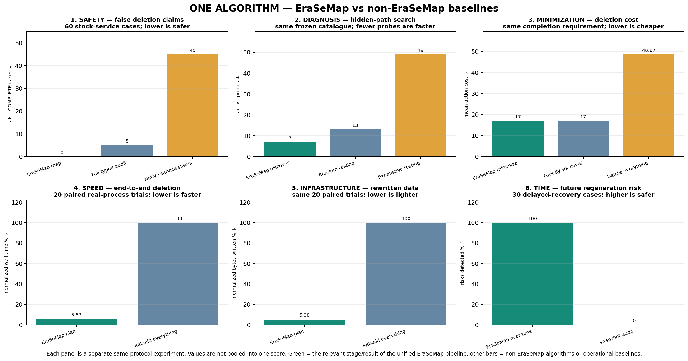

# EraSeMap competition evidence scorecard

Snapshot: 2026-08-30. This is a stable evidence map, not an official score or probability of
winning. EraSeMap has one public algorithm and three stages: FIND, ERASE, PROVE.

## Stable assessment

| Dimension | Current | Why | Next score-changing event |
|---|---:|---|---|
| Problem clarity | 9.8/10 | One question and one three-stage flow; human usability result still `NOT_COLLECTED` | At least 10 unfamiliar participants pass frozen endpoints |
| Practical relevance | 9.7/10 | Applies to identity, ML lineage, biometric vectors, backups, caches, and model influence | Authorized organization pilot |
| Narrow scientific novelty | 9.8/10 | Fail-closed composition of bounded active path discovery, physical/model erasure, temporal replay, and scoped certificate | Independent prior-art review plus external topology |
| Experimental methodology | 9.9/10 | Frozen protocols, negative controls, exact oracles, hashes, prospective transfer, and preserved failures | Independently authored preregistered holdout |
| Scientific claim completion | 9.8/10 | Conditional formal core and multiple measured layers; Qwen failures and external pending status are explicit | External hidden result or stronger preregistered model result |
| Real inputs and transfer | 9.5/10 | Public Olivetti/TOFU inputs and real PostgreSQL, Redis, Qdrant, Keycloak, MLflow, backup, cache, and model processes | Authorized real records or redacted production instrumentation |
| Independence of evidence | 7.8/10 | External software and public inputs, but mappings, faults, and runs are project-authored | One verified outside evaluator submission |
| Formal justification | 9.8/10 | Lean checks PCUG, exact action selection, temporal composition, exact controls, and bounded discovery contracts | Independent proof review |
| Engineering | 9.9/10 | Strict typing, full tests, provenance, offline verifiers, fail-closed API, Docker/live adapters | External deployment/release audit |
| Reproducibility | 9.9/10 | Committed protocols, raw evidence, frozen dependencies, oracle gates, and release script | Independent clean-machine reproduction |
| FaceID/eGov/KYC applicability | 9.5/10 | One contract covers physical, derivative, model, and recovery paths; production integration absent | Authorized domain pilot |
| Competition presentation readiness | 9.8/10 | One algorithm, Russian defense/Q&A, bilingual paper, executable showcase | Timed unfamiliar-reviewer rehearsal |

The independence row is not averaged away. More internally authored code cannot move it above 7.8.
Removing redundant algorithm names improves clarity but does not fabricate new scientific evidence,
so headline evidence scores do not jump merely because the architecture is cleaner.

## Strongest evidence by the three stages

### FIND

- Frozen stock-service transfer: `0/60` EraSeMap false completes versus `5/60` full typed audit and
  `45/60` native service status.
- Frozen bounded graph comparison: 7 active probes versus 7 greedy, 13 random, and 49 exhaustive;
  0 false-confident active decisions. The tie with greedy is stated.
- Live stock-service run: Redis, Keycloak, MLflow, and Qdrant; five cases, five probes, no recurrence,
  retained loss, or cleanup failure.

### ERASE

- Exact selector: 3,072/3,072 matches with a separately structured brute-force oracle.
- Measured local system: 20/20 paired completions, 17.64× geometric-mean speedup, 94.62% fewer
  written bytes, and no retained-data loss versus rebuild-all.
- Model channel: bounded face candidate has positive project-authored evidence, but Qwen v1 and v2
  fast candidates failed their full frozen gates. Exact retraining remains the safe fallback.

### PROVE

- Temporal lab: 30/30 future risks detected, 10/10 safe cases accepted, 10/10 coverage faults
  fail-closed, and 0/30 post-control physical recurrence.
- Exact temporal selector: 16,384/16,384 matches with exhaustive oracle.
- Formal results: represented-path soundness, finite action optimality, temporal composition, and
  finite control optimality under explicit assumptions.

## One-algorithm comparison dashboard



Each panel is one same-protocol comparison. Values from incompatible experiments are not pooled into
one superiority score.

## Evidence boundaries

- Project-authored evidence is not called independent.
- Real software is not called production infrastructure.
- Public datasets are not called real customer records.
- Conditional Lean theorems do not prove topology coverage in an organization.
- Fast unlearning is not accepted merely because it is faster.
- A signed certificate proves integrity of recorded evidence, not existence of uninstrumented stores.

## Event-based score policy

- Independence 7.8 → about 9.5 only after an accepted outside evaluator submission satisfying the
  frozen rubric.
- 10/10 is not used while a substantial feasible next validation step remains.

## Reproduce

```bash
./scripts/reproduce_release.sh core
erasemap showcase --repo-root . --output outputs/jury-showcase-v1
```
